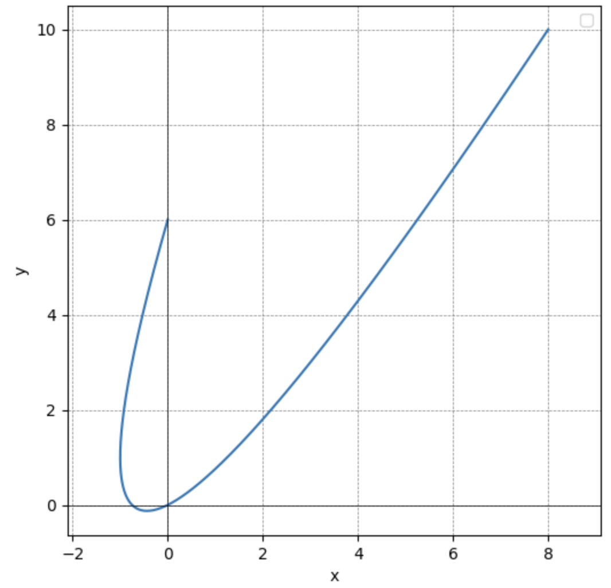

# 東大数学をPythonで解いてみた

大した理由はないのですが東大数学をPythonで解いてみたくなったのでいくつか解きやすそうな問題を選定してやってみました。

# 2019東大理系数学第一問

$次の定積分を求めよ.$

$\int_{0}^{1} (x^2+\frac{x}{\sqrt{1+x^2}})(1+\frac{x}{(1+x^2){\sqrt{1+x^2}}}) \, dx $

## 解答

sympyを使えばあっという間です。

```python
from sympy import symbols, sqrt, integrate

x = symbols('x')
f = (x**2 + x / sqrt(1 + x**2)) * (1 + x / ((1 + x**2) * sqrt(1 + x**2)))
integral_result = integrate(f,(x, 0, 1))
print(integral_result)
```

実行結果

```
-35/12 + pi/8 + 5*sqrt(2)/2
```

立式のコードを間違えなければ3分でできます。

# 2006東大理系後期数学第一問


$xy平面上でtを変数とする媒介変数表示$

$$
\left\{
\begin{aligned}
x &= 2t + t^2 \\
y &= t + 2t^2
\end{aligned}
\right.
$$

$で表される曲線をCとする.$

$曲線Cの概形をxy平面上に描け.$

## 解答

正確にはこの問題は4つの小問に分かれており、これはその最後の問いです。

誘導が丁寧な問題なのですが、Pythonではむしろ丁寧な誘導問題の方が煩雑だったりするので直接グラフの概形を描画していきます。

```python
import numpy as np
import matplotlib.pyplot as plt

t = np.linspace(-2, 2, 500)
x = 2 * t + t ** 2
y = t + 2 * t ** 2

plt.figure(figsize=(6, 6))
plt.plot(x, y)
plt.xlabel("x")
plt.ylabel("y")
plt.axhline(0, color='black',linewidth=0.5)
plt.axvline(0, color='black',linewidth=0.5)
plt.grid(color = 'gray', linestyle = '--', linewidth = 0.5)
plt.legend()
plt.show()
```

実行結果



一番手間取ったのは`matplotlib`のimportでした。

# 2024東大理系数学第6問

$f(x)=x^3+10x^2+20xとする。$

$f(n)が素数となるような整数nを全て求めよ。$

## 解答

正確にはこの問題は(1)で、(2)は証明問題なのでプログラムで解くのは不向きそうだったので省略しました。

```python
import sympy as sp

def f(n):
    return n**3 + 10*n**2 + 20*n

def is_prime(x):
    if x < 2:
        return False
    for i in range(2, int(x**0.5) + 1):
        if x % i == 0:
            return False
    return True

n_range = range(-100, 100)
prime_n_values = []

for n in n_range:
    result = f(n)
    if is_prime(result):
        prime_n_values.append(n)

prime_n_values
```

実行結果

```
[-7, -3, 1]
```

nの範囲を勘で -100≦n≦100 にしたので数学的に正しいかと言われると正しくなさそうです。

ただ「〜となるような整数nを全て求めよ」系の問題は大抵答えが一桁の整数になりがちです。

# まとめ

わかっていたことですが、Pythonはグラフの描画や純粋な計算処理は強いけれど、論証や確率・整数の分野等は苦手みたいです。
