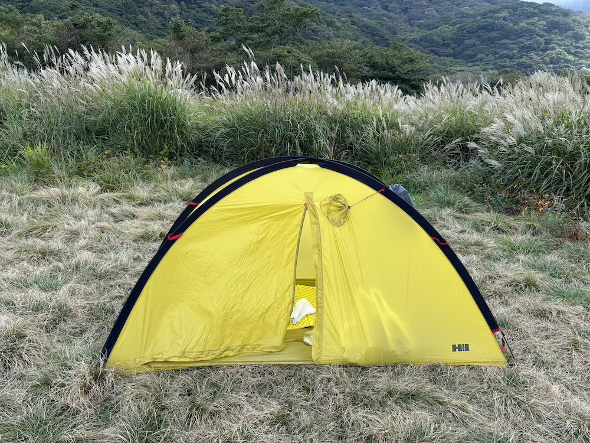

# アウトドア用品 BEST BUY 2024

趣味というか仕事柄というか、自然と戯れることが多いので今年のBEST BUYを適当に書いていきます。

# 第3位

## HERITAGE [クロスオーバードーム＜2G＞](https://heritage.co.jp/Gears/COD_2G.html)

晩夏の久住でテン泊するために購入しました。

重量が690gでとにかく軽いです。5分で設営できる点も魅力です。

ただ、とても薄いテントなので雨が降ると浸水してしまうかも。霧雨くらいなら大丈夫でした。

価格：¥63,800

# 第2位

## ALTRA [OLYMPUS 6 HIKE LOW GTX](https://altrafootwear.jp/products/olympushikelowgtx2m24fw)

そもそも僕が幅広甲高の29cmの靴しか履けないので選択肢がALTRAかモンベルのワイドサイズくらいしかないのですが、雪の久住でも一切の不安を感じさせない安心感がありました。

まだ一回しか使っていないので早く次の山に行きたいです。

価格：¥36,300

# 第1位

## HONDA [N BOX（2012年式）](https://www.honda.co.jp/auto-archive/nbox/2012/)

こいつがいなければ今年のアウトドアはほとんど成立しなかったと言っても過言ではないです。

古い車なので多少汚れても気にしないですし、軽でありながら広々とした車内で小回りも効くので大変重宝しました。

汚れても気にしないと言いながら、壁に擦ったときは凹みました。

ちなみにナンバーが素数だったので「素子」と名付けましたがあまり定着していません。

価格：¥340,000

※夏場にエアコンが効かなくなって修理代7万かかりました。

# まとめ

車を除いても今年のギアへの累計課金額は20万を超えてそうです。

ただ課金額よりも圧倒的に満足感の方が高いので2025年もほどほどにギアに課金していこうと思います。
