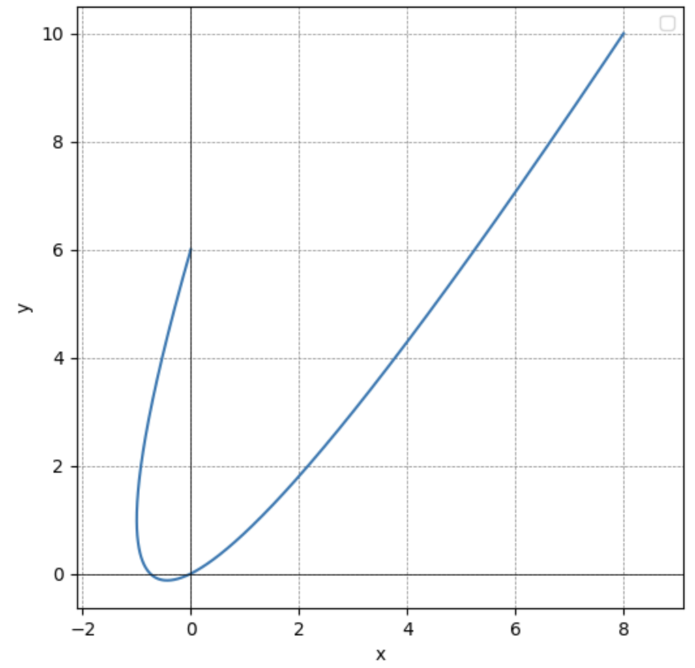
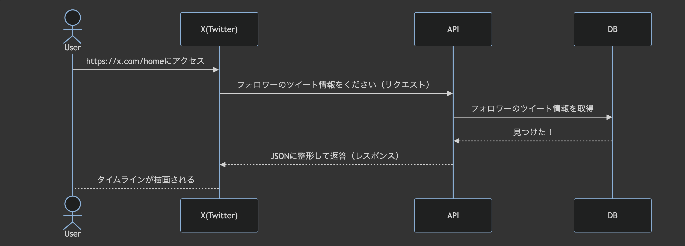
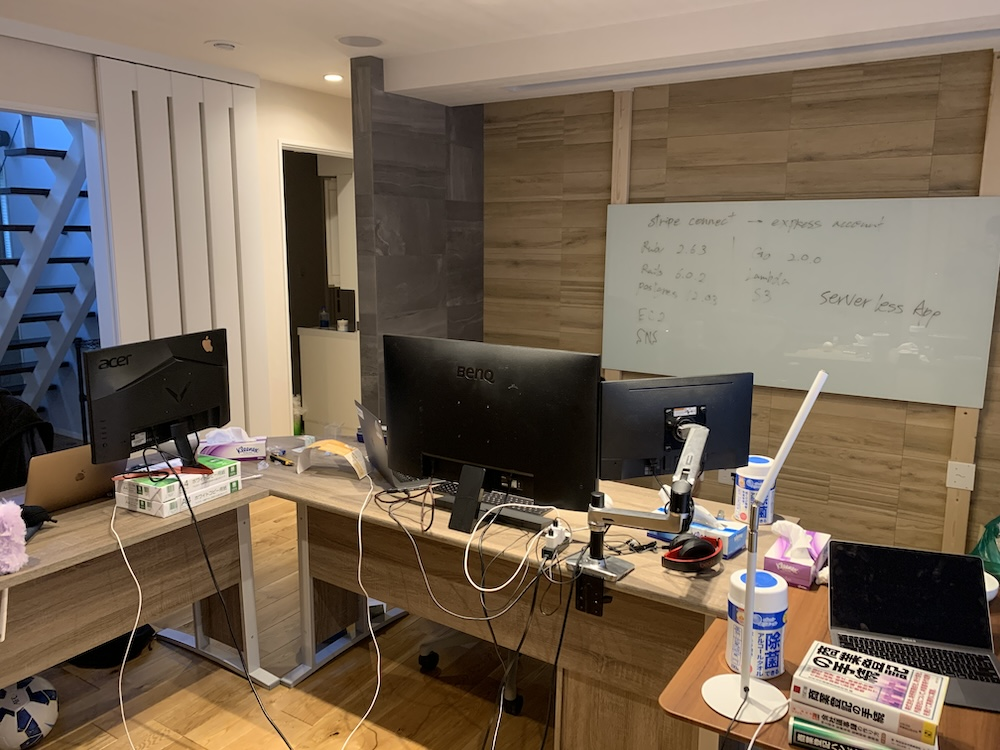

# Welcome to 0Cuopen's Blog

福岡在住の豚骨エンジニア🍜

仕事や趣味のことなど💻⛰️🎣

# New Arrivals

    <a href="2024/12/29/solve_UT_math_exam" class="blog-horizontal-card">
        
        

            <h3 class="blog-title">東大数学をPythonで解いてみた</h3>
            
大した理由はないのですが東大数学をPythonで解いてみたくなったのでいくつか解きやすそうな問題を選定してやってみました。

        

    </a>

    <a href="2024/12/27/gear_of_the_year_2024" class="blog-horizontal-card">
        
        

            <h3 class="blog-title">GEAR OF THE YEAR 2024</h3>
            
趣味というか仕事柄というか、自然と戯れることが多いので今年のBEST BUYを適当に書いていきます。

        

    </a>

    <a href="2024/12/25/what_is_api" class="blog-horizontal-card">
        
        

            <h3 class="blog-title">APIとは何か</h3>
            
バックエンドエンジニア（以下、BEエンジニア）は多くの場合、APIと呼ばれるものを作っています。例えば「iOSエンジニアです」と言われたら

        

    </a>

    <a href="2024/12/24/my_startup_failure_story" class="blog-horizontal-card">
        
        

            <h3 class="blog-title">起業戦記</h3>
            
実はコロナ大流行時に若気の至りで起業していたことがありました。新卒で入社した上場企業を1年足らずで退職しスキルも実績もない

        

    </a>

# SNS

    
    
    

