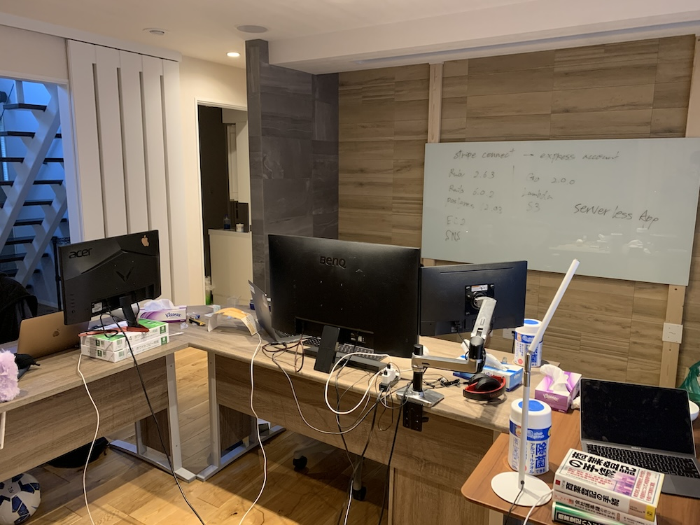
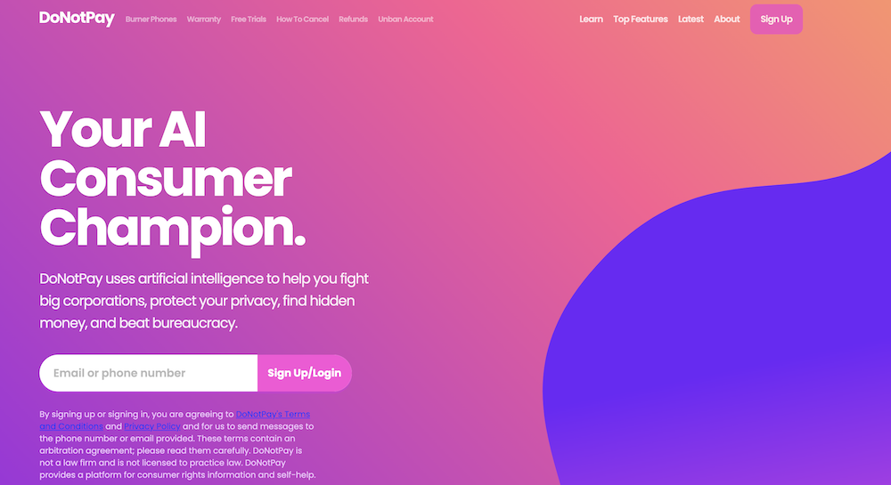

# 起業戦記

実はコロナ大流行時に若気の至りで起業していたことがありました。

新卒で入社した上場企業を1年足らずで退職しスキルも実績もない若造が何をしてどう失敗したのかを備忘録も兼ねてつらつらと書いていきます。

# 立ち上げ

まずはじめに、起業したといっても僕が社長だったわけではなく専務取締役兼CTOという名ばかりの肩書きで共同創業しました。

当時の僕はプログラミングスクールの卒業課題レベルのものしか作る能力がなく、Railsエンジニアを名乗っているくせに実務経験はほぼなく、新卒の会社ではSQLでデータ分析をしているというような状況でした。

そんなときに大手外資で働いていた友人が起業の話を持ちかけてきてくれて、「おもろそうだしやってみるか」という恐ろしく軽いノリで退職→起業と進んでしまったわけです。

社会人になって始めて九州の田舎から東京に出てきて、「ここで一発当ててやるんや」みたいな謎の高揚感に自分自身が飲まれていた感は正直否めないです。

その後なんだかんだ4人で創業することになり東京の生活費が高すぎるということで、みんなで長野の一軒家を借りオフィス兼自宅としての起業生活が始まったのでした。

# 地獄の週100時間

起業あるあるかもしれませんが、創業初期は週100時間働いて当然みたいな雰囲気があり我々もそれを採用することにしました。単純計算で1日あたり14.5時間労働です（週休0）。

やってみれば意外とできてしまうものですが、睡眠とご飯以外は基本全て仕事だけで自由な時間は1日1時間くらいだったと記憶しています。

余裕で過労死ラインでしたが、精神的には圧倒的熱量でカバー出来ていたため全然死にませんでした。

# プロダクト

当初はC向けのリーガルテックのプロダクトを実装していました。当時の国内のリーガルテックは僕たちの調べた限りだとほぼB向けのプロダクトばかりで、法律の壁などもありC向けはハードルが高かったのだと思います。

参考にしたプロダクトはイギリスの[DoNotPay](https://donotpay.com/)です。今は亡きTechCrunch Japanに記事が載っていて創業メンバーで盛り上がっていました。イギリス発のサービスで駐禁取り消し申請ができるところから始まり、今は手広くやっているようです。

ただこの模倣プロダクトは様々な要因がありリリース前にピボットしました（書ききれないので割愛します）。

その後、当時飲食店の無断キャンセルが話題になっていたため、無断キャンセルに対してスムーズに法的な対応ができる予約台帳サービスを作ったのですが、コロナ禍により内定していた契約を全て断られました。

飲食業界だけでなく宿泊業界にも営業をかけたのですが、結果は芳しくなく…

ちなみにこのとき初めて営業電話をかけたのですが、営業先のおじさまに「お前の話し方ムカつく」と言われて、以降営業を任されることはなくなりました🎉

その後もクーポンをSMSで送信できるサービスをリリースしたり、その他ありとあらゆるサービスを検討してはピボットしてを繰り返して、なんだかんだあって解散することとなりました。

# 良かったこと

  <ul>
    <li>上記のカオスを20代前半のたった1年間で経験できた
      <ul>
      <li>おそらく新卒の会社でそのまま働いていたら一生経験することのなかった出来事のオンパレード</li>
      <li>tryすれば意外となんとかなるという精神が身についた</li>
      </ul>
    </li>
    <li>エンジニアとして「スクール卒業生レベル」から「作りたいものを自由に作れるレベル」くらいには成長できた
      <ul>
      <li>実質半年くらいの期間で決済機能を含む4つのプロダクトを完成させた</li>
      </ul>
    </li>
    <li>筋トレの習慣が身についた
      <ul>
      <li>健康のためという理由でオフィス兼自宅にパワーラックを購入し、みんなで毎日筋トレしていた</li>
      <li>元々細身だったがそのおかげで肉付きが良くなった</li>
      </ul>
    </li>
    <li>料理がちょっとだけできるようになった
      <ul>
      <li>週代わりでメンバーが全員分の料理を作っていた</li>
      </ul>
    </li>
  </ul>

# 反省点

  <ul>
    <li>目標が全て無謀すぎてもはや意味をなしていなかった
      <ul>
      <li>例えばリリースしたばかりのプロダクトで「今週売り上げ100万円取るぞ！」みたいな</li>
      </ul>
    </li>
    <li>MVPでリリースして市場の温度感を確認すべきだった
      <ul>
      <li>最初からある程度完成度の高いものを作って、結局ピボットを繰り返してた</li>
      </ul>
    </li>
    <li>コーディングのアンチパターンを踏みまくった
      <ul>
      <li>DRYやYAGNI原則など完全無視（というか知らなかった）</li>
      <li>エンジニアとしてあまりにも未熟だった</li>
      </ul>
    </li>
    <li>古い付き合いの友人だったが解散後は疎遠になってしまった
      <ul>
      <li>最後にお金周りでちょっとだけ揉めた</li>
      <li>解散時は本当に無一文で縁もゆかりもない長野からどうやって脱出するのかというリアル脱出ゲーム状態だった</li>
      </ul>
    </li>
  </ul>

MVP: 必要最小限の製品。「Minimum Viable Product」の略

DRY: コンピューターのプログラミングやシステム開発において、同じ処理や情報を複数回記述しないようにする設計原則。「Don't Repeat Yourself」の略

YAGNI: 「必要なもの以外を実装するな」という考え方。「You Ain't Gonna Need It」の略

# まとめ

総じて、あのとき起業をして本当に良かったと思っています。どちらかといえば大変なことの方が多く失ったものもありましたが、あの1年はその後の僕のキャリアや価値観に大きな影響を与えてくれました。

ただ、世界で活躍している同年代を見るようになって「起業して良かった」レベルで落ち着いてしまっているのが悔しいという気持ちもあります。そしてこの悔しささえも年々色褪せてきています。

この悔しさが消えない内に、これからも自分の限界にチャレンジできるようなことをしたいなと思っています🚀
