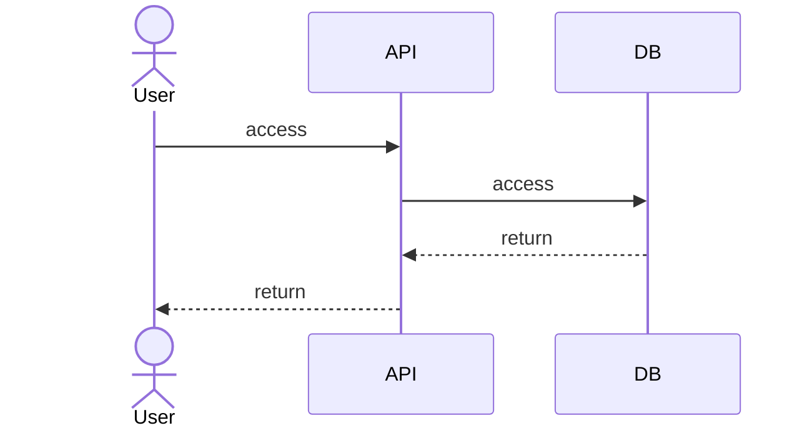

# particles.js

- great
  - good

# CSS

|id|name|content|
|--|--|--|
|1|hoge|fuga|

# mermaid

```mermaid
%%{init: {'theme': 'default', 'securityLevel': 'loose', 'themeVariables': {
  'primaryColor': '#1f77b4',
  'nodeTextColor': '#ffffff',
  'edgeLabelBackground': '#444444'
}}}%%
sequenceDiagram
  Actor User
  participant API
  participant DB

  User ->> API: access
  API ->> DB: access
  DB -->> API: return
  API -->> User: return
```
