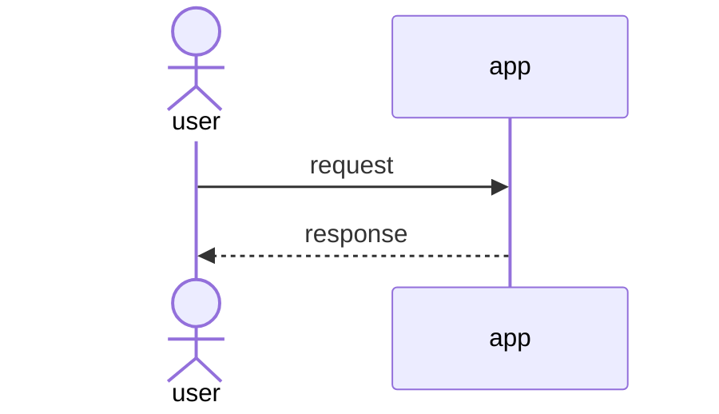

# sample

sample

- aaaa
- bbbb
- cccc

```mermaid
sequenceDiagram
    actor user
    participant app

    user ->> app: request
    app -->> user: response
```

```mermaid
erDiagram
    users {}
    posts {}

    users --{ posts
```
