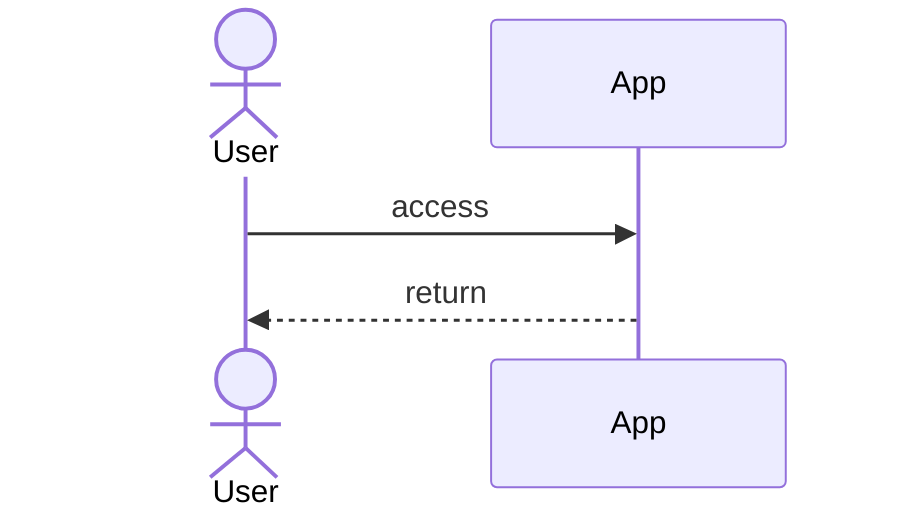



# sample

- aaa
- ccc

```mermaid
sequenceDiagram
  Actor User
  participant App

  User ->> App: access
  App -->> User: return
```

sequenceDiagram
  Actor User
  participant App
  User ->> App: access
  App -->> User: return

