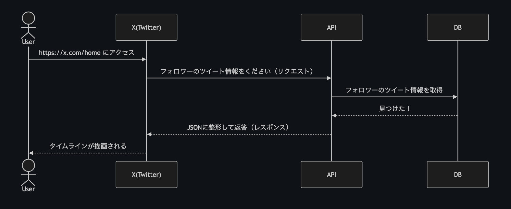

# はじめに

この記事は以前社内LTで発表したときにやや好評だったため、このブログでも公開することにしました。

# この記事の目的

バックエンドエンジニア（以下、BEエンジニア）は多くの場合、APIと呼ばれるものを作っています。

例えば「iOSエンジニアです」と言われたら「iPhoneアプリ作ってるのかな」くらいはなんとなく想像できますが、BEエンジニアの仕事は関わりがない人からしたらかなりブラックボックスな部分が多いかと思います。

そこでこの記事では、BEエンジニアをよく知らない方達に「なんかよくわからんけど小難しいことしてんなー」くらいの認識から「あー、APIつくってんのね」と言ってもらえるくらいに解像度を上げることを目的としています。

ちなみにみなさんが普段PCやスマホから使っているサービスの目に見えている部分（UI）を作っているエンジニアはフロントエンドエンジニアと呼ばれます。

※簡潔に説明するために正確ではない表現を使っている場合があります

# APIとは何か

一言で言えば

「リクエストが来たらデータベース（DB）を操作してJSONをレスポンスするもの」

# DBとは何か

エクセルやスプレッドシートをイメージできればOKです。

例えばX（旧Twitter）だとおそらく以下のようなDB設計をしているはずです。

ユーザーについてのデータ

|id|account_id|name|
|--|--|--|
|1|0Cuopen|おぺん|
|2|hoge|fuga|
|..|..|..|

ポスト（ツイート）についてのデータ

|id|user_id|content|
|--|--|--|
|1|1|こんにちは|
|2|1|疲れた|
|3|2|おやすみ|
|..|..|..|

上記のようなさまざまな種類のデータを全部ひっくるめたものがデータベースです。

# JSONとは何か

以下のようなフォーマットの文字列のことです。

DBから受け取った情報をアプリなどで表示するために、決められたフォーマットに従って整形します。

```json
{
  "tweet": {
    "id": 1,
    "content": "こんにちは",
    "user": {
      "id": 1,
      "account_id": "0Cuopen",
      "name": "おぺん"
    }
  }
}
```

# リクエスト/レスポンスとは何か

リクエスト：

フロントエンド（アプリやWeb）がAPIに対して送る「こんな処理を実行してください」と言う命令のこと

レスポンス：

上記のリクエストに従ってDBを操作し、何らかのJSONをフロントエンド側に返答すること



# APIはいつ使われているのか

Webやアプリのほぼ全ての画面で何らかのAPIが使われています。

ざっくり分けると以下の2つに分けられます。

<div class="ul_wrapper">
  <ul>
    <li>画面遷移時に実行されるAPI</li>
    <ul>
      <li>データを取得するだけ</li>
      <li>Xのホーム画面や、そこからポスト詳細に移動するときなど</li>
    </ul>
    <li>フォーム送信時に実行されるAPI</li>
    <ul>
      <li>データの作成・更新・削除が行われる場合が多い</li>
      <li>Xの投稿画面やいいね、リポストなど</li>
    </ul>
  </ul>
</div>

# 何がAPIの開発を遅らせるのか

<div class="ul_wrapper">
  <ul>
    <li>複雑すぎる要件</li>
    <ul>
      <li>50歳以上のユーザーについてはA、30歳以上の男性ユーザーについてはB、20歳以上の福岡に住んでいるユーザーについてはC、、、</li>
      <li>実際はこれよりもっと複雑怪奇な要件が山ほどある</li>
    </ul>
    <li>影響範囲が大きい</li>
    <ul>
      <li>少し修正しただけなのに思わぬところ（他のAPIなど）で影響が出てしまう</li>
    </ul>
    <li>パフォーマンスが悪い</li>
    <ul>
      <li>データ量が多すぎてDBを操作するのに時間がかかる</li>
      <li>リクエストしてからレスポンスされる（画面が描画される）まで1秒以上かかるとかなりの数のユーザーが離脱してしまう</li>
    </ul>
    <li>外部APIなどの利用</li>
    <ul>
      <li>決済機能などはStripeという外部のAPIを利用する必要がある</li>
      <li>外部APIの仕様を理解して正しく実装しなければならない</li>
      <li>社内稟議が必要</li>
    </ul>
    <li>技術的難易度が高い</li>
    <ul>
      <li>情報・前例が少ない</li>
      <li>原因不明のバグ</li>
    </ul>
  </ul>
</div>

その他多くの理由によりAPIの開発は遅れます

# まとめ

これを読んだあなたは今日からBEエンジニアです。

これから一緒にAPIを開発していきましょう。
